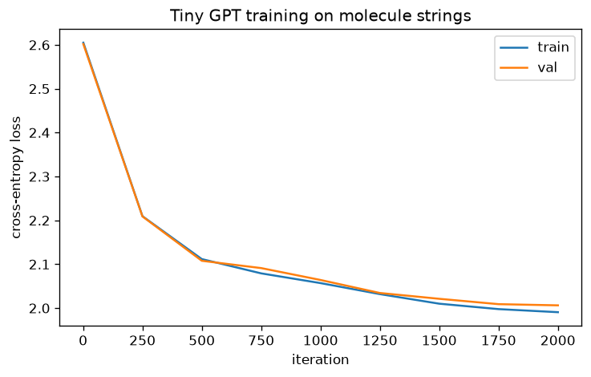

# Tiny Transformer From Scratch

A small **GPT built from scratch in PyTorch** — hand-written multi-head causal
self-attention, no `nn.Transformer` — trained to generate **molecules** written as
SMILES-style strings. It learns the language's *structure* well enough to invent
new, structurally-valid molecules it never saw in training.

Not English on purpose: a formal "language" with crisp rules lets us **measure**
what the model actually learned, instead of eyeballing prose.



## What it learned (measured)

Trained for 2,000 iterations (~5 min on a laptop CPU, 607K parameters), then asked
to generate 300 molecules:

| Metric | Result |
|---|---|
| **Structurally valid** generations | **66%** |
| Random baseline (same alphabet, no model) | **0.9%** |
| **Novel** (not in the training set) | **198/199** |
| Unique among valid | 100% |

The model is **~73× better than chance** at producing valid molecules — and nearly
everything it generates is new. It isn't memorizing; it learned the rules.

Molecules it invented (valid, novel):

```
CNFO#CC          O2C(NO)#C2        ONCC2=CF(OO)N2
CFN=CCS(C)#NCCC  NCC5C=N#S(O)N#C5  C#CFNCC#C=CN2S2
```

## The part that shows off attention

A molecule can open a **ring bond** with a digit and must **close it with the same
digit** later — e.g. `C2...C2`, `N4...N4`. Those two digits can be many characters
apart, so getting it right is a genuine **long-range dependency** — exactly what
self-attention is for. A model without attention (an n-gram, say) can't reliably
pair them; this one does, which is a big part of why 66% of its output is valid.
Balanced branch parentheses `( )` are a second structural rule it picks up.

## Quickstart

```bash
pip install -r requirements.txt
python tests/test_tinygpt.py     # fast checks (no training) incl. an overfit test
python main.py                    # train (~5 min CPU) then generate + score
```

Or step by step:

```bash
python train.py --iters 3000     # train longer for a higher validity rate
python sample.py                 # generate molecules, report validity/novelty
```

No downloads: the training corpus is generated procedurally and is valid by
construction. A GPU is optional (the code uses it automatically if present); the
numbers above are CPU-only.

## How the model works

A GPT is a stack of identical blocks. Each block does two things, each wrapped in a
residual connection:

1. **Causal self-attention** — every token computes a query, looks at the keys of
   all *earlier* tokens, and pulls in a weighted mix of their values. The causal
   mask forbids looking ahead. This is where long-range structure is captured.
2. **MLP** — a small position-wise feed-forward network that transforms each token.

Add token embeddings (what a symbol means) + positional embeddings (where it sits),
run the blocks, and a final linear layer predicts the next character. Training is
plain next-token prediction with cross-entropy — the same objective as a full-size
LLM, just tiny. It's all in [`tinygpt/model.py`](tinygpt/model.py), commented.

## Project structure

```
tinygpt/
  model.py       the GPT: embeddings, hand-written attention, blocks, LM head
  molecules.py   the SMILES-style "language": procedural generator + validity checker
  tokenizer.py   character-level tokenizer
train.py         training loop (small CPU config) + loss curve
sample.py        generate molecules and measure validity / novelty
tests/           forward-shape, validator, corpus, and overfit tests
main.py          train then sample
```

## Things to try (make it yours)

- **Train longer / bigger** (`--iters 5000 --n_layer 4 --n_embd 192`) and watch the
  validity rate climb.
- **Sweep temperature** in `sample.py` (0.5 = safer/more valid, 1.0 = more diverse).
- **Swap the language:** point the tokenizer at chess PGN moves or MIDI note events
  — the model doesn't change, only the data and the validity check.
- **Real chemistry:** replace the structural checker with **RDKit** to measure true
  chemical validity, not just balanced brackets.
- **Add a metric:** track validity rate *during* training to see when structure emerges.

## What this is — and isn't

- **Is:** a correct, readable transformer you can actually follow end to end —
  attention, training loop, sampling — with a measurable notion of "did it learn."
- **Isn't:** a real molecular generator. "Validity" is structural (brackets and ring
  digits), not chemical; the corpus is synthetic; the model is deliberately tiny.

## Requirements

- Python 3.9+
- PyTorch (CPU is fine), Matplotlib for the loss curve.
